<div align="center">

# Cosmos Nanotech · Quantum Mechanics

**A visual computational-physics laboratory in C and Python**

Thirty-six compiled programs spanning numerical methods, classical mechanics,
many-body motion, tight-binding spectra, quantum walks, and optimized quantum
state transfer.

</div>

<table>
  <tr>
    <td width="50%">
      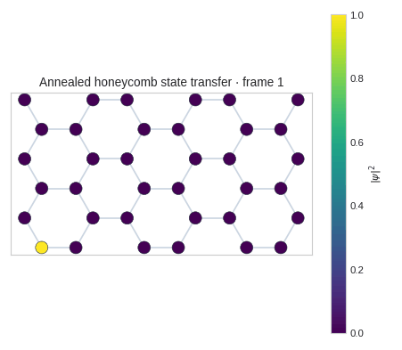
    </td>
    <td width="50%">
      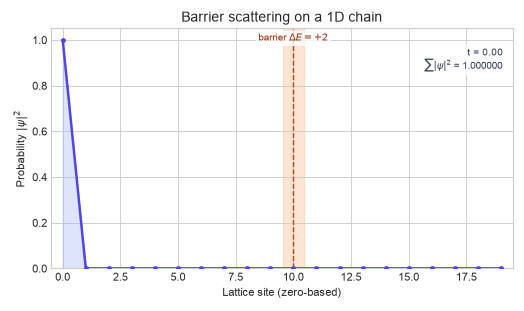
    </td>
  </tr>
  <tr>
    <td align="center"><strong>Annealed honeycomb state transfer</strong></td>
    <td align="center"><strong>Barrier scattering on a 1D chain</strong></td>
  </tr>
</table>

## What this repository explores

The early labs build the numerical foundation: C programming, integration,
oscillators, projectile motion, diffusion, orbital dynamics, matrix
operations, three-body trajectories, and Lennard–Jones molecular dynamics.
Lab 12 applies those tools to tight-binding Hamiltonians and quantum transport.

> [!NOTE]
> The original early-lab directory was cumulative. Its files are now separated
> into a best-fit Lab 0–11 sequence based on program complexity, dependencies,
> Git history, and related UC Davis course material. See the
> [reconstruction notes](labs/README.md) for confidence levels and evidence.

| Area | Examples |
| --- | --- |
| Numerical methods | finite differences, matrix multiplication, timed computation |
| Classical dynamics | projectiles, springs, Kepler orbits, three-body motion |
| Statistical and many-body physics | random walks, diffusion, molecular dynamics |
| Quantum mechanics | tight-binding spectra, 1D and 2D quantum walks |
| Optimization | simulated annealing of couplings for state transfer |

## Quantum transport gallery

<table>
  <tr>
    <td width="50%">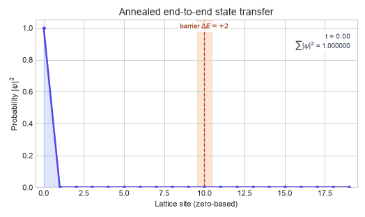</td>
    <td width="50%">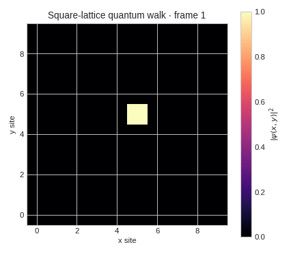</td>
  </tr>
  <tr>
    <td align="center"><strong>Optimized transfer through a barrier</strong></td>
    <td align="center"><strong>Square-lattice quantum walk</strong></td>
  </tr>
  <tr>
    <td>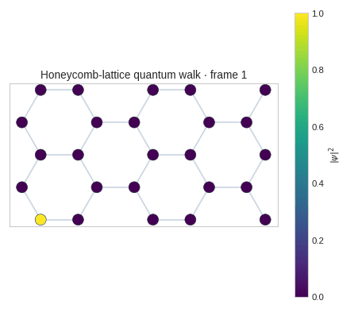</td>
    <td></td>
  </tr>
  <tr>
    <td align="center"><strong>Honeycomb quantum walk</strong></td>
    <td align="center"><strong>Optimized honeycomb transfer</strong></td>
  </tr>
</table>

<div align="center">
  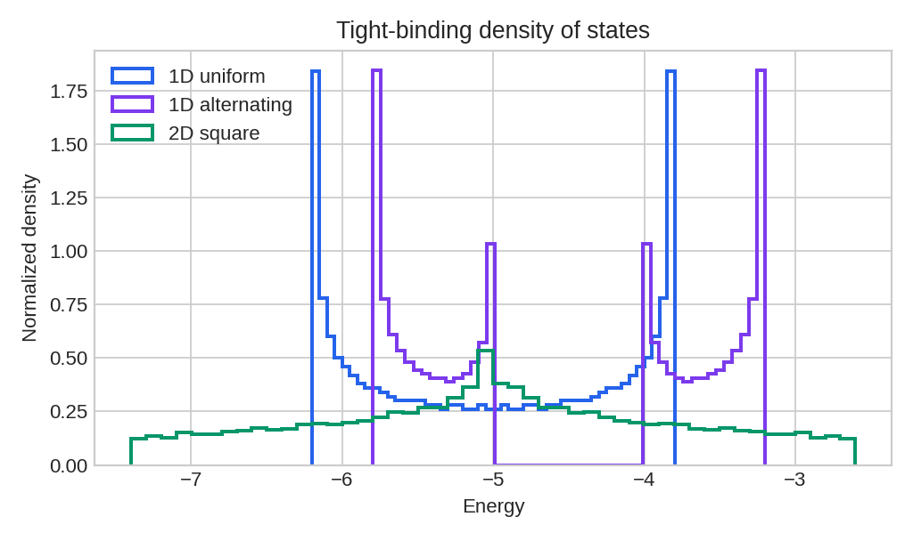
  <br>
  <strong>Tight-binding density of states: uniform chain, alternating chain,
  and square lattice</strong>
</div>

## Computational physics gallery

<table>
  <tr>
    <td width="50%">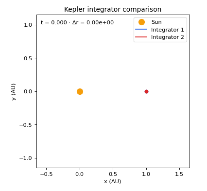</td>
    <td width="50%">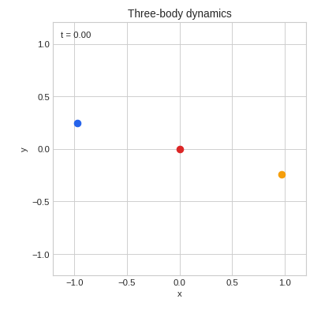</td>
  </tr>
  <tr>
    <td align="center"><strong>Kepler integrator comparison</strong></td>
    <td align="center"><strong>Three-body dynamics</strong></td>
  </tr>
  <tr>
    <td>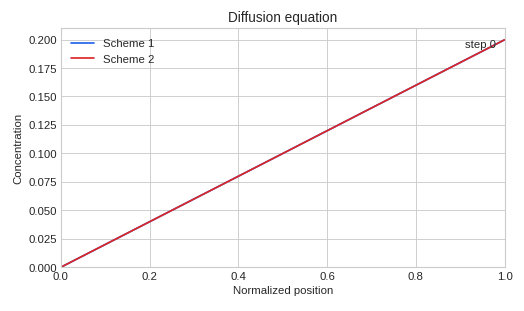</td>
    <td>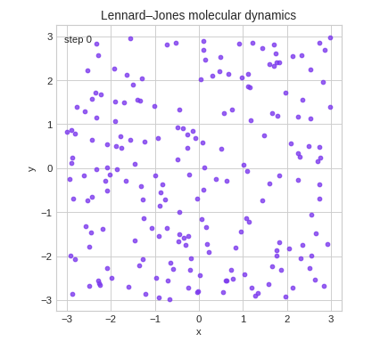</td>
  </tr>
  <tr>
    <td align="center"><strong>Diffusion schemes</strong></td>
    <td align="center"><strong>Lennard–Jones molecular dynamics</strong></td>
  </tr>
  <tr>
    <td>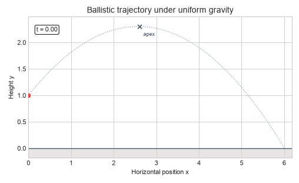</td>
    <td>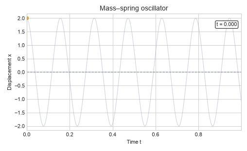</td>
  </tr>
  <tr>
    <td align="center"><strong>Projectile motion</strong></td>
    <td align="center"><strong>Mass–spring oscillator</strong></td>
  </tr>
</table>

## Repository layout

```text
.
├── Makefile                 # one-command builds and gallery generation
├── docs/assets/             # README-ready GIFs and plots
├── labs/
│   ├── 00/ … 11/            # reconstructed, topic-based early labs
│   │   ├── README.md        # topic, contents, and confidence note
│   │   ├── src/             # C programs assigned to that lab
│   │   ├── data/            # associated simulation output, when present
│   │   └── scripts/         # associated plotting tools, when present
│   └── 12/                  # original Lab 12 label
│       ├── src/             # 10 C programs plus LAPACK/BLAS helpers
│       ├── data/            # spectra, couplings, and quantum evolution
│       ├── results/         # original static figures
│       └── scripts/         # focused Lab 12 plotting tools
└── scripts/
    └── generate_gallery.py  # regenerates every visual shown above
```
Browse the [reconstructed Lab 0–11 index](labs/README.md) or the
[Lab 12 notes](labs/12/README.md).

## Build

The C programs require GCC or Clang, `make`, BLAS, and LAPACK. On
Debian/Ubuntu:

```bash
sudo apt install build-essential libblas-dev liblapack-dev
make -j
```

Successful builds are written to matching directories from `build/00/`
through `build/12/`. The build directory is intentionally ignored because
every executable is reproducible from source.

Useful targets:

```bash
make early      # compile the 26 reconstructed Lab 0–11 programs
make lab06      # compile one inferred lab by its two-digit number
make lab12      # compile the 10 Lab 12 programs
make check      # compile all 36 programs and syntax-check Python
make clean      # remove generated executables
```

## Regenerate the visuals

Create a Python environment, install the plotting dependencies, then rebuild
the full gallery:

```bash
python3 -m venv .venv
source .venv/bin/activate
python -m pip install -r requirements.txt
make visuals
```

The gallery generator samples long trajectories into compact GIFs while
leaving the full-resolution data untouched.

## Run selected Lab 12 simulations

Commands are designed to run from the repository root:

```bash
./build/12/timeevolve
./build/12/timeevolve2d 10
./build/12/timehex

./build/12/annealbarrier
./build/12/evolvebarrier

./build/12/annealhex
./build/12/evolveannealed

make visuals
```

The simulation executables update files in `labs/12/data/`; `make visuals`
then refreshes the presentation assets from those results.

## Notes

- Matrices in Lab 12 use column-major storage to interoperate with BLAS and
  LAPACK.
- Generated datasets and gallery assets are committed so the experiments are
  inspectable without rerunning expensive simulations.
- Generated machine binaries are not committed.
